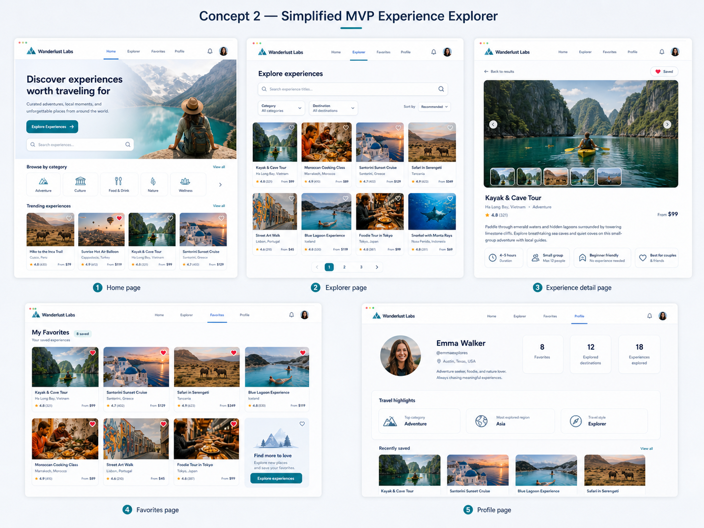

# Wanderlust Labs

Wanderlust Labs is a frontend MVP for a travel-tech experience explorer. The product lets users browse curated travel experiences, search and filter by category or destination, view detail pages, save favorites, and see a simple mock profile.

The app is intentionally scoped as a discovery UI, not a booking platform. There is no checkout, authentication, payment flow, availability calendar, or backend data source.

## Chosen UI Direction

The selected design direction is **Concept 2 — Simplified MVP Experience Explorer**: a clean, modern, image-forward marketplace UI with soft teal branding, white card surfaces, rounded corners, subtle shadows, and clear search/filter controls.



Source: ChatGPT-generated UI example mockup, used as the visual reference for the Wanderlust Labs MVP.

## Design References

**ChatGPT UI Mockup Concept** — the primary design source for this project. It defines the five-page MVP direction: home, explorer, experience detail, favorites, and profile, with an image-forward card grid and teal-accented marketplace styling.

**Airbnb Experiences** — inspired the card-based browsing model, large travel imagery, rounded image cards, and lightweight favorite interactions.

**GetYourGuide** — influenced the explorer page structure, especially the prominent search bar, category/destination filters, rating/price treatment, and browsable marketplace layout.

**Tripadvisor** — informed the use of ratings, destination metadata, and familiar travel-discovery hierarchy for quick comparison across experiences.

## Tech Stack

- Next.js with App Router
- TypeScript
- Tailwind CSS
- React client state for favorites
- `lucide-react` icons
- Local TypeScript data only

## MVP Routes

- `/` — Home page with hero, category browse, and trending experiences
- `/experiences` — Explorer page with search, filters, and experience grid
- `/experiences/[id]` — Experience detail page
- `/favorites` — Saved favorite experiences
- `/profile` — Mock user profile with live favorites count

## Local State Note

Favorites are stored only in React state for the current session. Refreshing the browser resets saved favorites. This is intentional for the MVP.

## Getting Started

```bash
npm install
npm run dev
```

Then open the local development URL shown in the terminal.

## Project Structure

```txt
src/
├── app/                 # App Router pages and root layout
├── components/          # Shared marketplace UI components
├── data/                # Local TypeScript experience dataset
├── hooks/               # Favorites and URL filter hooks
└── types/               # Shared TypeScript interfaces
```

The experience catalog lives in `src/data/experiences.ts` and contains 100 local records. Favorites are held in React state through a top-level provider and reset on refresh by design.

## Project Scope

Build the discovery experience only. Do not add checkout, bookings, payments, authentication, databases, real accounts, external travel APIs, maps, calendars, traveler counters, reviews, or notification functionality.
